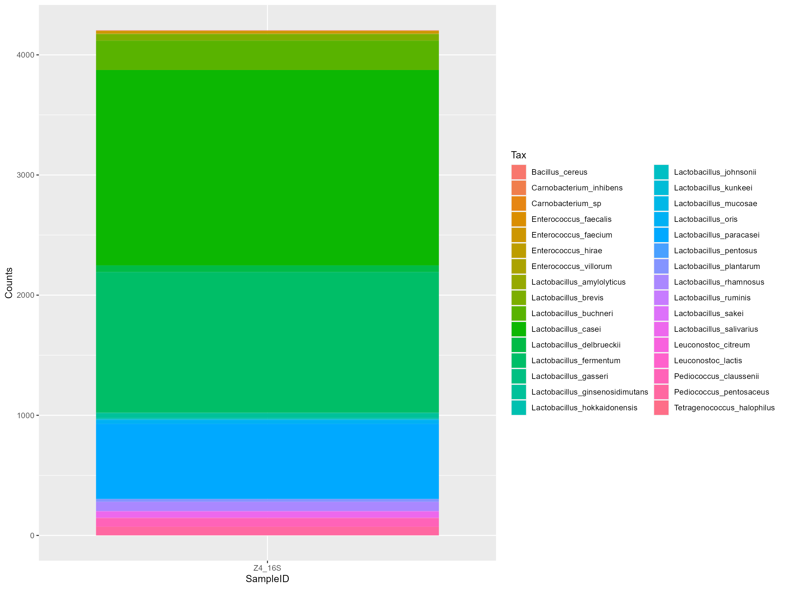

# Nanopore metagenomic analysis

In this repository we follow the basic analysis pipeline for metagenomic samples sequenced by Oxford Nanopore Technologies. We analized 16S bacterial biomarker from whiskey samples. I followed the workflow published by [Anna Cuscó & Carlotta Cattozi](https://osf.io/cbeqj). Moreover, I used scripts developed by Nelly Selem, Paul Marquez and J. Abel Lovaco from this [repository](https://github.com/paul1000ton-coder/Whiskey--16s-analysis).

## Programming languages
- R
- Bash

## R libraries
- readr
- doBy
- reshape2
- ggplot2
- viridis

## Software
- porechop
- minimap2
- yacrd

## Installation
```
conda install -c bioconda porechop
conda install -c bioconda minimap2
conda install -c bioconda yacrd
```

## Workflow
<p align="center">
    
<p>


## Pre-processing summary
| Sample ID | Sample name Rstudio | Raw data | After porechop | After trimming and filtering | After chimera removal |
|-----------|---------------------|----------|----------------|------------------------------|-----------------------|
| BC01      | Z1_16S              | 8116     | 7970           | 7037                         | 7004                  |
| BC02      | Z2_16S              | 5397     | 5244           | 4405                         | 4397                  |
| BC03      | Z3_16S              | 4722     | 4565           | 4048                         | 4043                  |
| BC04      | Z4_16S              | 5282     | 5087           | 4212                         | 4208                  |

## Taxonomy analysis result
We used the [rnn](https://github.com/alfbenpa/rrn_db) database "operon.100.fa" to map the operons found by minimap2 and used ggplot2 to plot the results
<br />

a) Results for BC01 sample
<p align="center">
    
<p>
b) Results for BC02 sample
<p align="center">
    
<p>
c) Results for BC03 sample
<p align="center">
    
<p>
d) Results for BC04 sample
<p align="center">
    
<p>
